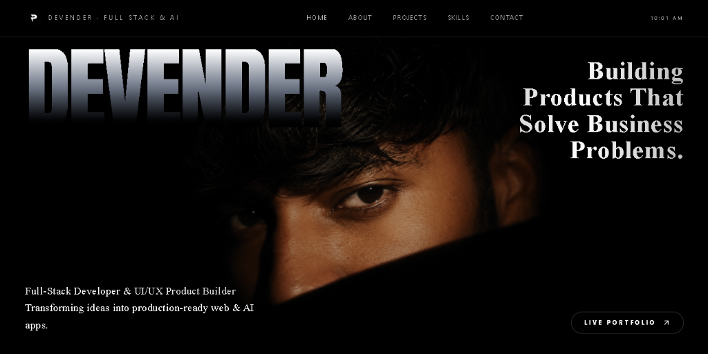

# 🎬 Devender — Cinematic Portfolio & Product Builder

<div align="center">
  

<br/><br/>

[](https://devendhargopagoni.netlify.app/)
[](https://react.dev/)
[](https://www.typescriptlang.org/)
[](https://tailwindcss.com/)
[](https://threejs.org/)
[](https://vitejs.dev/)

</div>

---

## 🌟 Overview

Hi, I'm **Devender** — a Full-Stack Web Developer and UI/UX-focused Product Builder. I specialize in designing and developing premium websites, SaaS platforms, AI-powered applications, dashboards, and modern digital experiences that solve real business problems.

This portfolio is built with a **cinematic UI theme**, incorporating fluid micro-animations, glassmorphic 3D interactive elements, and high-performance frontend architecture.

---

## 🚀 Key Features

- **🎴 Interactive 3D ID Badge Card**: Glassmorphic lanyard ID card featuring dynamic 3D mouse tilt tracking, real-time specular light reflections, and custom portrait graphics.
- **🎬 Cinematic Horizontal Project Reveal**: Custom project reveal carousel (_"Work that makes an impact."_) featuring peeking side previews, 3D tilt interaction, progress counters `[01 02 03 04 05]`, and floating device mockups.
- **⚡ Interactive Tech Stack Grid**: Interactive grid showcasing core frontend, backend, database, and AI tool competencies.
- **📄 Integrated Interactive Resume & Offerings**: Embedded resume preview and service offerings.
- **📱 Direct Action & Social Integration**: Instant action buttons for **Email Me** and **WhatsApp** (`+91 7569949639`), alongside links to GitHub, LinkedIn, Instagram, and Telegram.

---

## 🛠️ Tech Stack

| Category            | Technologies                                                        |
| :------------------ | :------------------------------------------------------------------ |
| **Core Framework**  | React 19, TypeScript, React Router v7                               |
| **Build & Tooling** | Vite v7, Bun / npm                                                  |
| **3D & Motion**     | Three.js, `@react-three/fiber`, `@react-three/drei`, Framer Motion  |
| **Styling**         | Vanilla CSS, Tailwind CSS v4, Glassmorphism, Responsive Breakpoints |
| **Icons & UI**      | Lucide React, React Icons                                           |
| **Deployment**      | Netlify Continuous Deployment                                       |

---

## 💻 Getting Started Locally

### Prerequisites

Make sure you have **Node.js** (v18+) and **npm** installed on your system.

### 1. Clone the Repository

```bash
git clone https://github.com/devendharoff/devendhar-portfolio-cinematic.git
cd devendhar-portfolio-cinematic
```

### 2. Install Dependencies

```bash
npm install
```

### 3. Run Development Server

```bash
npm run dev
```

Open your browser and navigate to `http://localhost:8080` (or the port specified in terminal output).

### 4. Build for Production

```bash
npm run build
```

---

## 📬 Contact & Connect

- **Website**: [https://devendhargopagoni.netlify.app/](https://devendhargopagoni.netlify.app/)
- **Email**: `devendhargopagoni@gmail.com`
- **WhatsApp / Phone**: `+91 7569949639`
- **GitHub**: [@devendharoff](https://github.com/devendharoff)
- **LinkedIn**: [Devender Goud](https://www.linkedin.com/in/devender-goud-033875338/)
- **Instagram**: [@devendharoff](https://www.instagram.com/devendharoff/?hl=en)
- **AI Agency**: [@connects.ai](https://www.instagram.com/connects.ai)

---

<div align="center">
  <sub>Built with ❤️ by Devender</sub>
</div>
